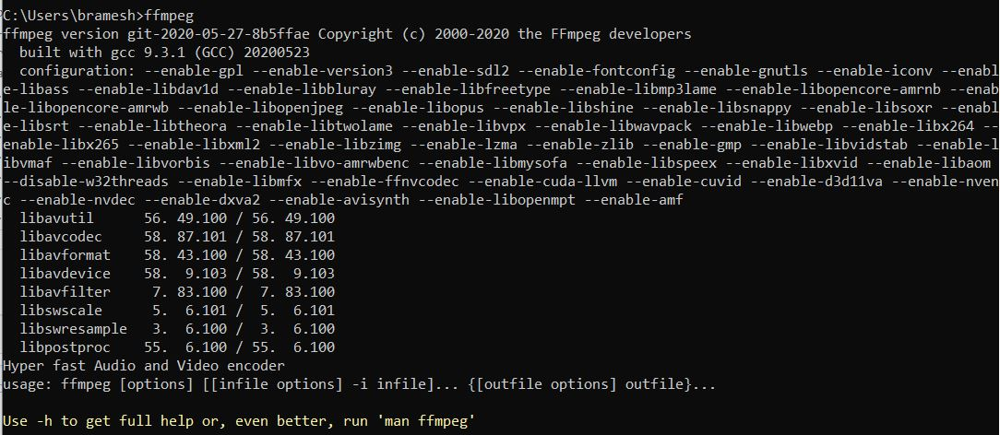

# Selcukes Reports

[](https://search.maven.org/search?q=g:%22io.github.selcukes%22%20AND%20a:%22selcukes-reports%22)
[](https://travis-ci.org/selcukes/selcukes-reports)
[](https://www.codacy.com/gh/selcukes/selcukes-reports?utm_source=github.com&amp;utm_medium=referral&amp;utm_content=selcukes/selcukes-reports&amp;utm_campaign=Badge_Grade)
[](https://sonarcloud.io/dashboard?id=selcukes_selcukes-reports)
[](https://sonarcloud.io/dashboard?id=selcukes_selcukes-reports)
[](https://sonarcloud.io/dashboard?id=selcukes_selcukes-reports)
[](http://www.oracle.com/technetwork/java/javase/downloads/index.html)
[](http://www.apache.org/licenses/LICENSE-2.0)

selcukes-reports helps to record video  and send notifications using Slack and Microsoft teams.

To use add the `selcukes-reports` dependency to your pom.xml:

```xml
<dependencies>
  [...]
    <dependency>
        <groupId>io.github.selcukes</groupId>
        <artifactId>selcukes-reports</artifactId>
        <version>${selcukes-reports.version}</version>
    </dependency>
  [...]
</dependencies>

```

## Video Screen Recorder:
Automatically saves a video recording if the test fails. Another great way to see what was the cause of test failure is to watch a video of the whole test execution. Since only the visible part of the screen can be recorded, video recording can be combined with the scroll to visible feature. If it is enabled in the configuration, before performing an action on an element, Selcukes scrolls until the element is visible on the screen.
Another enhancement of the videos is the highlighting of elements. Before each action, the element is highlighted, which makes it easier to spot later in the videos. 

## Test Result Notifications:
Currently we moved to On premises environments. To view HTML report generated by automation scripts we need to connect to the different bank VPN’s to open the report and check the related screenshots to see which test case has failed and why.
So, why not raise an alert as soon as the test case fails? And why not attach a screenshot along with that alert so that all the stakeholders can actually see what has failed in the application?

## Usage
Example Cucumber Hooks class

```java
import io.cucumber.java.*;
import io.github.selcukes.core.logging.Logger;
import io.github.selcukes.core.logging.LoggerFactory;
import io.github.selcukes.reports.screen.ScreenPlay;
import io.github.selcukes.reports.screen.ScreenPlayBuilder;
import org.openqa.selenium.WebDriver;

public class CucumberHooks {
    Logger logger = LoggerFactory.getLogger(getClass());
    WebDriver driver;
    ScreenPlay screenPlay;

    @Before
    public void beforeTest(Scenario scenario) {
        WebDriverBinary.chromeDriver().setup();
        driver = new ChromeDriver();
       
        screenPlay = ScreenPlayBuilder.getScreenPlay(driver, scenario);
         // start video recording..
        screenPlay.start();

        logger.info(() -> "Before Scenario .." + scenario.getName());
    }

    @After
    public void afterTest(Scenario scenario) {
        logger.info(() -> "After Scenario .." + scenario.getName());
        screenPlay.attachScreenshot(); //Attach Full page screenshot to cucumber report
        screenPlay.attachVideo(); //Attach video to cucumber report on Failure
        screenPlay.attachLogs(); //Attach INFO Level Logs to cucumber report
    }
}
```
<details>
  <summary>FFmpeg Installation and configuration!</summary>
Please follow below steps to install FFMPEG:

For Ubuntu follow below commands:
```linux
sudo add-apt-repository ppa:mc3man/trusty-media
sudo apt-get update
sudo apt-get dist-upgrade
sudo apt-get install ffmpeg
```
For Mac just use brew:
```linux
brew install ffmpeg
```
For Windows
<ol>
<li>Download ffmpeg and extract to folder <br/>
Ex: C:\ffmpeg</li>
<li>Add FFMPEG bin to PATH variable.<br/>
Ex: C:\ffmpeg\bin</li> 
<li>Download SendSignalCtrlC.exe from here and put into the ffmpeg bin folder<br/>
  Ex: C:\ffmpeg\bin</li>
</ol>
To be sure that everything works properly, open CMD and perform following command:




</details>

## TestNG Example
Get Github SNAPSHOT version from jitpack. 

```xml
<repositories>
        <repository>
            <id>jitpack.io</id>
            <url>https://jitpack.io</url>
        </repository>
</repositories>
```

This is Github SNAPSHOT version(0.0.3-SNPSHOT) testNG example 

```java

package io.github.selcukes.reports.tests;

import io.github.selcukes.core.commons.os.Platform;
import io.github.selcukes.core.config.ConfigFactory;
import io.github.selcukes.core.logging.Logger;
import io.github.selcukes.core.logging.LoggerFactory;
import io.github.selcukes.reports.enums.RecorderType;
import io.github.selcukes.reports.enums.TestStatus;
import io.github.selcukes.reports.screen.ScreenPlay;
import io.github.selcukes.reports.screen.ScreenPlayBuilder;
import io.github.selcukes.wdb.WebDriverBinary;
import org.openqa.selenium.WebDriver;
import org.openqa.selenium.chrome.ChromeDriver;
import org.testng.ITestResult;
import org.testng.annotations.AfterMethod;
import org.testng.annotations.AfterTest;
import org.testng.annotations.BeforeTest;
import org.testng.annotations.Test;

public class ScreenPlayTest {
    private final Logger logger = LoggerFactory.getLogger(getClass());
    private WebDriver driver;
    private ScreenPlay screenPlay;

    @BeforeTest
    public void beforeTest() {
        ConfigFactory.loadLoggerProperties();
        WebDriverBinary.chromeDriver().setup();
        driver = new ChromeDriver();

        screenPlay = ScreenPlayBuilder
            .getScreenPlay(driver);
        
        //Start Video Recorder ....
        screenPlay
            .withRecorder(RecorderType.FFMPEG) //Remove this step to use default Recorder MONTE
            .start();

    }

    @Test
    public void loginTest() {
        //Actual Test Here
    }

    @AfterMethod
    public void afterMethod(ITestResult result) {
        if (Platform.isWindows()) {
            screenPlay
                .withResult(result)
                .attachWhen(TestStatus.ALL) //Remove this step to attach reports on Failure 
                .attachScreenshot()
                //.withNotifier(NotifierType.SLACK)   // Use this step to specify Notifier as SLACK
                .sendNotification("This is sample Test Step"); //Using default Notifier TEAMS
        }
    }

    @AfterTest
    public void afterTest() {
        driver.quit();

        screenPlay
            .attachVideo() //Stop and Attach Video to TestNG Report
            .attachLogs(); //Attach INFO Level Logs to TestNG Report
    }
}

```
